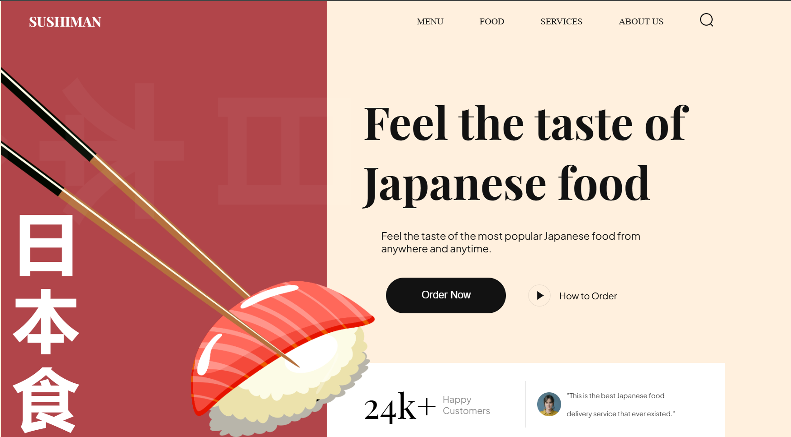

# Sushi Website



## Introduction
Develop a sushi website showcasing popular food, trending sushi, and drinks using HTML and CSS with smooth subtle animations.

## Tech Stack

- HTML 5
- CSS 3
- Vite

## Features

- **CSS Variables**: Utilize CSS variables to maintain a consistent and easily adjustable styling approach throughout the project.
- **Importing CSS Files**: Import CSS files into others, promoting modularity and organization in styling.
- **Flex and Position Properties**: Use of flex and position properties in CSS to create responsive and well-structured layouts.
- **Rendering HTML through JavaScript**: Rendering HTML through JavaScript using reusable functions, enhancing code efficiency.
- **Smooth Animations**: Smooth and subtle animations to enhance the overall user experience, focusing on fluid transitions.
- **BEM Method**: Follow the Block Element Modifier (BEM) methodology for naming classes, promoting a clear and maintainable structure.
- **Organized File and Folder Structure**: Maintain a well-organized file and folder structure for easy navigation and management of project assets.
- **Responsive Design**: The application is completely responsive across all devices, employing responsive design techniques such as media queries and fluid layouts.

all these while creating the sushi website with:

- Navigation Bar
- Creative Hero Section
- About Us Section
- Popular Food, Trending Sushi, and Drinks Sections
- Newsletter Signup and Footer

## Quick Start
Follow these steps to set up the project locally on your machine:

### Prerequities

Make sure you have the following installed on your machine:

- [Git](https://git-scm.com/)
- [NodeJs](https://nodejs.org/en)
- [npm](https://www.npmjs.com/)(Node Package Manager)

### Cloning the Repository
```bash
git clone https://github.com/conbopk/Sushiman.git
cd Sushiman
```

### Instalation
Install the project dependencies using npm:
```bash
npm install
```

### Running the Project
```bash
npm run dev
```

Open [http://localhost:5173](http://localhost:5173) in your browser to view the project.


